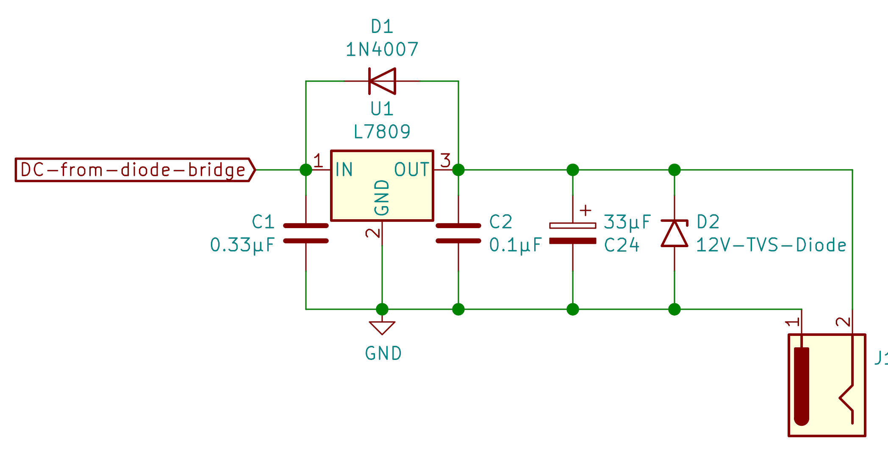
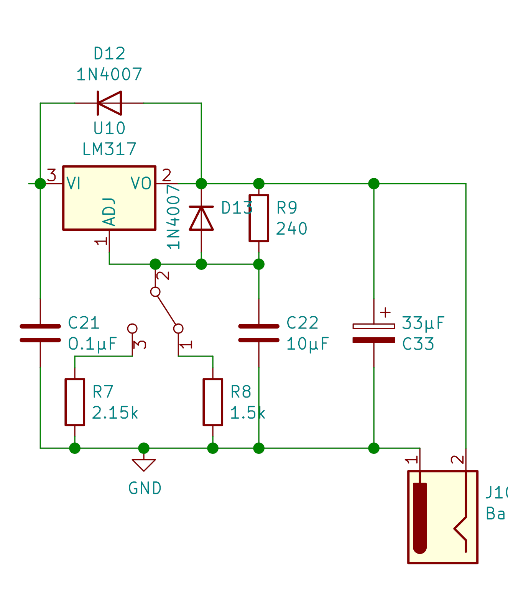
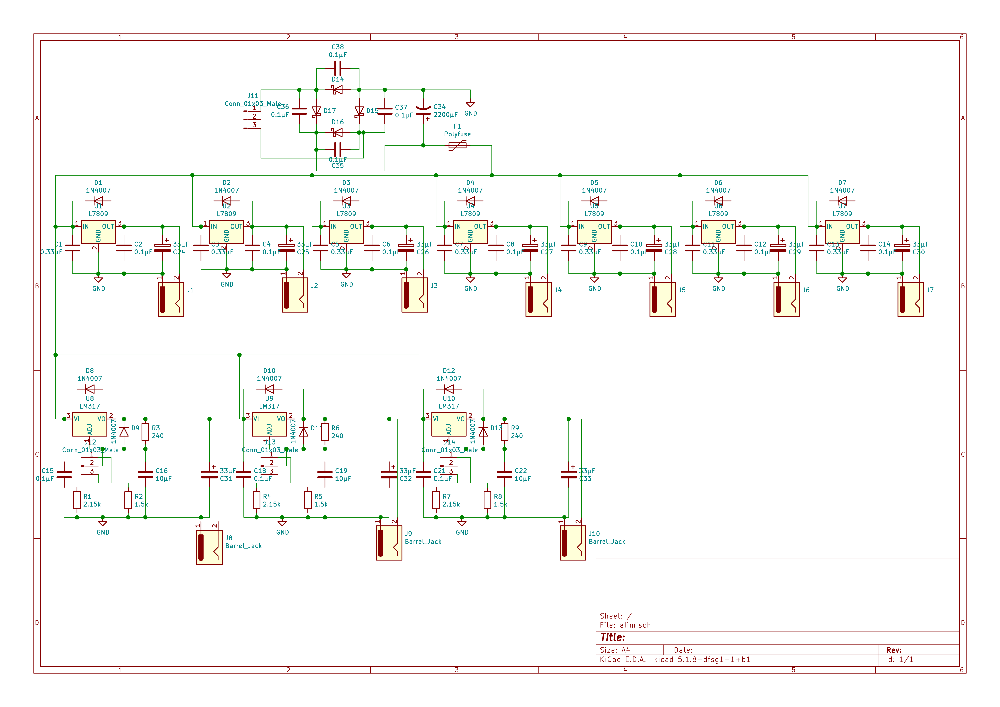
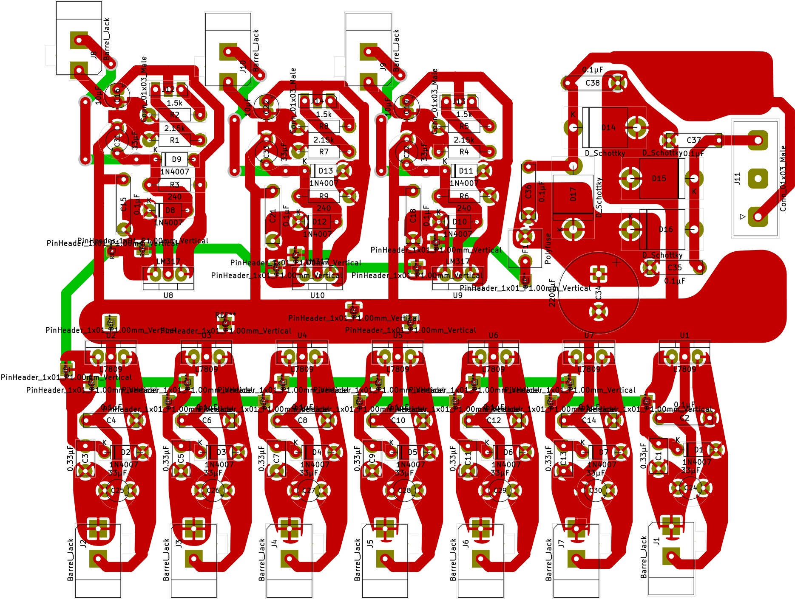
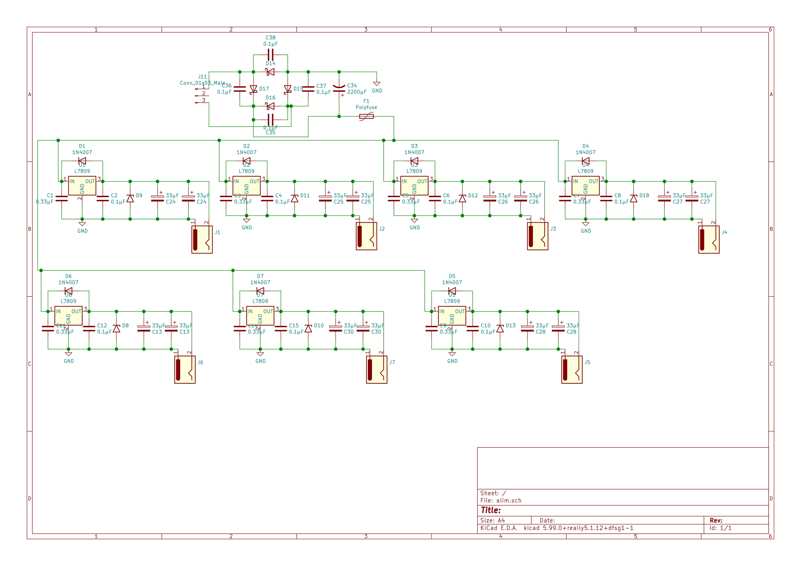

# PedalBoard-Alimentation
***
## Table of contents
1. [230V Schematic](#230v-schematic)
2. [Diode Bridge Schematic](#diode-bridge-schematic)
3. [Regulated ouput Schematic](#regulated-output-schematic)
    1. [9V Output](#9v-output)
    2. [9-12V Output](#9-12v-output)
8. [Replicate Project](#replicate-project)
    1. [10 Outputs (7x9v + 3x9-12v) Version](#10-outputs-version)
    2. [7 Outputs (7x9v) Version](#7-outputs-version)
    3. [Custom power supply](#custom-power-supply)
7. [Kicad sources files](#Kicad-sources-files)
8. [Issues](#issues)
***
## 230V Schematic

This is a basic schematic in order to protect your pedalboard against surges (VDR), short-circuit (fuse), electrical noise(EMI filter). You have to use at least a 230/12VAC transformer (best option because it causes less power dissipation on your regulators) and at most 230/18VAC transformer (you have to adapt this limit to your regulators specs). Keep in mind that after the diode brige the voltage is : 

For exemple this is the tension at the output of the diode bridge if your transformer ouput is 18V :

## Diode Bridge Schematic

You connect each transformer outputs (if your transformer have only one secondary coil) on the "From-transformer-secondary-output_X" labels.
There are capacitors in parallel of each diodes to minimize noise from diodes. You have also a 2200µF capacitor to "smooth" the voltage from the diode bridge.
Finaly, you have a 1.85A polyfuse to protect your power supply and pedals mainly against short-circuits. All regulators are connected on "diodes bridge output".

## Regulated Output Schematic
Both regulations can be used in the same power supply. However keep in mind that you have to adapt transformer, diodes for the diodes bridge and polyfuse to the maximum current which can be used by your power supply (and add a margin of course).
### 9V Output

The 4007 diode is used to prevent non-regulated voltage to go into your regulated voltage. C2 and C24 basicaly reduce noise from the regulator. The TVS diode protect your pedals against surges. I suggest to use 1A or 1.5A regulators to minimize thermal dissipation and to have an important margin ( specialy if you want to connect several pedals). Moreover, you have to had a heatsink to your regulator (a piece of aluminium should be enough).
### 9-12V Output

This circuit is based on LM317. You have a switch (or anything else you want which can switch) between 2 resistors. The value of this two resistor is calculted to deliver 9V for the 1.5k resistor and 12v for the 2.15k resistor. You can add an other resistor and change your switch to choose between 9,12, and 18V for exemple. The output voltage of an LM317 in this case is calculated by the relation :

)

In this case, R7 or R8 are R2 and R9 is R1. For exemple, let's calculate Vout for R8 :

=9.06V)

C22 and C33 do the same job as same capacitors for the 9V ouput.

## Replicate Project
### 10 Outputs Version
Here is the schematic. Please note that it's the first version so this schematic and the associated pcb don't include TVS diodes.
The first row contain 9V outputs and the second contain adjustable outputs.

I designed the associated pcb :

If you want to replicate with this exact pcb you can download the [pdf of the pcb](Images/10O/alim-F_Cu.pdf) and use your prefered methode to create pcb. You can also download the [kicad schematic](Sources/10O/alim10o.sch) if you want to create your own pcb design or simply take a look at it. You can also download the [entire kicad project](Sources/10O.zip) with schematic and pcb.
#### Bill of Materials
You can [download it](Sources/10O/alim10o.csv) in csv format
|Ref                                                          |Qnty|Value          |Description                                                                                           |
|-------------------------------------------------------------|----|---------------|------------------------------------------------------------------------------------------------------|
|C1, C3, C5, C7, C9, C11, C13,                                |7   |0.33µF         |Unpolarized capacitor                                                                                 |
|C2, C4, C6, C8, C10, C12, C14, C15, C18, C21, C35, C36, C37, C38, |14  |0.1µF          |Unpolarized capacitor                                                                                 |
|C16, C19, C22,                                               |3   |10µF           |Unpolarized capacitor                                                                                 |
|C24, C25, C26, C27, C28, C29, C30, C31, C32, C33,            |10  |33µF           |Polarized capacitor                                                                                   |
|C34,                                                         |1   |2200µF         |Polarized capacitor, US symbol                                                                        |
|D1, D2, D3, D4, D5, D6, D7, D8, D9, D10, D11, D12, D13,      |13  |1N4007         |Diode                                                                                                 |
|D14, D15, D16, D17,                                          |4   |D_Schottky     |Schottky diode                                                                                        |
|F1,                                                          |1   |Polyfuse       |Resettable fuse, polymeric positive temperature coefficient                                           |
|J1, J2, J3, J4, J5, J6, J7, J8, J9, J10,                     |10  |Barrel_Jack    |DC Barrel Jack                                                                                        |
|J11,                                                         |1   |Conn_01x03_Male|Generic connector, single row, 01x03, script generated (kicad-library-utils/schlib/autogen/connector/)|
|J12, J13, J14,                                               |3   |Conn_01x03_Male|Generic connector, single row, 01x03, script generated (kicad-library-utils/schlib/autogen/connector/)|
|R1, R4, R7,                                                  |3   |2.15k          |Resistor                                                                                              |
|R2, R5, R8,                                                  |3   |1.5k           |Resistor                                                                                              |
|R3, R6, R9,                                                  |3   |240            |Resistor                                                                                              |
|U1, U2, U3, U4, U5, U6, U7,                                  |7   |L7809          |Positive 1.5A 35V Linear Regulator, Fixed Output 9V, TO-220/TO-263/TO-252                             |
|U8, U9, U10,                                                 |3   |LM317          |1.5A 35V Adjustable Linear Regulator, TO-220                                                          |

If you want to replicate this pcb, I advise you to download at least the kicad pcb file to know where are components.

## 7 Outputs version

Here is the [schematic](Images/7O/alim7O.png) :

And the associated [pcb](Images/7O/alim-brd7O.png) :

If you want to replicate this exact version, you can download the [pdf of the pcb](Images/7O/alim-F_Cu.pdf) or download the [pcb](Sources/7O/alim.kicad_pcb),[schematic](Sourcces/7O/alim.sch) or the [entire kicad project](Sources/7O.zip). I advise you to download at least the [pcb](Images/7O/alim-brd7O.png) or the [kicad pcb file](Sources/7O/alim.kicad_pcb) if you want to replicate this project.

### Bill of material
You can [download it](Sources/7O/BOM-7O.csv) in csv format.
|Ref                                                          |Qnty|Value          |Description                                                                                           |
|-------------------------------------------------------------|----|---------------|------------------------------------------------------------------------------------------------------|
|C1, C3, C5, C7, C9, C11, C14,                                |7   |0.33µF         |Unpolarized capacitor                                                                                 |
|C2, C4, C6, C8, C10, C12, C15, C35, C36, C37, C38,           |11  |0.1µF          |Unpolarized capacitor                                                                                 |
|C13, C16, C24, C25, C26, C27, C28,                           |7   |33µF           |Polarized capacitor                                                                                   |
|C34,                                                         |1   |2200µF         |Polarized capacitorl                                                                                  |
|D1, D2, D3, D4, D5, D6, D7,                                  |7   |1N4007         |Diode                                                                                                 |
|D8, D9, D10, D11, D12, D13, D18,                             |7   |SM6T10A        |10V TVS diode                                                                                         |
|D14, D15, D16, D17,                                          |4   |D_Schottky     |3A Schottky diode                                                                                     |
|F1,                                                          |1   |Polyfuse       |Resettable fuse, polymeric positive temperature coefficient                                           | 
|J1, J2, J3, J4, J5, J6, J7,                                  |7   |Barrel_Jack    |DC Barrel Jack                                                                                        |
|J11,                                                         |1   |Conn_01x03_Male|Generic connector, single row                                                                         |
|U1, U2, U3, U4, U5, U6, U7,                                  |7   |L7809          |Positive 1.5A 35V Linear Regulator, Fixed Output 9V                                                   |

## Kicad Sources files
* 10 outputs files :
    * [schematic](Sources/10O/alim10o.sch)
    * [pcb](Sources/10O/alim10o.kicad_pcb)
    * [bill of materials](Sources/10O/alim10o.csv)
    * [kicad project ( zipped )](Sources/10O.zip)
* 7 outputs files :
    * [schematic](Sources/7O/alim.sch)
    * [pcb](Sources/7O/alim.kicad_pcb)
    * [bill of materials](Sources/7O/BOM-7O.csv)
    * [kicad project ( zipped )](Sources/7O.zip)

## Issues
Please feel free to open an issue if you find an error, want more informations or something else.
